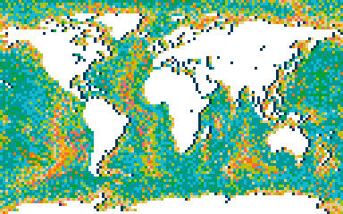
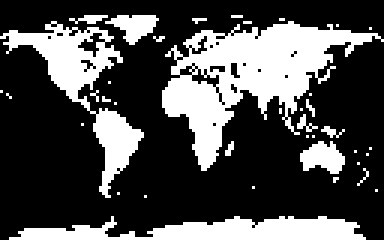
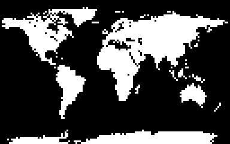
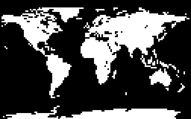

# lego-art-map-generator

Scripts for generating custom mosaics for the LEGO Art 'World Map' set.

It also has some notes of my research into the original LEGO 'World Map' set,
such as how LEGO might have created the projection, and any interesting design
decisions they made.

**This project is not affiliated with The Lego Group.**

## Interesting notes about the LEGO Art world map set

* The map appears to be a vertically stretched WGS84/EPSG:4326 projection,
  except all the continents are shifted 11.5 degrees to the west and 3.5 degrees
  to the south. This was probably done to ensure the
  [Chukchi Peninsula][chukchi-peninsula] wasn't cut off.
* Antarctica was also shifted a fair amount, although it's not clear what
  additional transformations were made.
* Unsurprisingly a lot of creative liberties were made with the coastline,
  mostly to emphasize certain islands and coastlines.


[chukchi-peninsula]: https://en.wikipedia.org/wiki/Chukchi_Peninsula

The box set contains an excess number of tiles to allow you to customise the
world a bit, but the excess number is not uniform for every color. For example,
you are given 3062 white tiles, and only have 2 unused tile left to spare.

The total number of tiles for each color are listed below:

| Tile color | # of tiles required for World Map | # of tiles in box set according to booklet | Actual # of tiles in my box |
|---|---|---|---|
|  | 3062 | 3064 | 3198 |
| ) | 392 | 393 | 410 |
| ) | 1606 | 1607 | 1668 |
| ) | 1878 | 1879 | 1956 |
| ) | 529 | 601 | 621 |
| ) | 1019 | 1060 | 1106 |
| ) | 724 | 725 | 752 |
| ) | 598 | 599 | 619 |
| ) | 229 | 601 | 625 |
| ) | 203 | 601 | 627 |
| **Total** | **10240** | **11130** | **11582** |

I also collected statistics on individual bags that I found in my set.
Your tile count will probably be different to mine, since there appears to be
some randomness.

| Bag name | tile count |
|---|---|
| White bag 1 | 1065 |
| White bag 2 | 1067 |
| White bag 3 | 1064 |
| White extras bag | 2 |
| Navy bag 1 | 408 |
| Navy extras bag | 2 |
| Cyan bag 1 | 829 |
| Cyan bag 2 | 837 |
| Cyan extras bag | 2 |
| Teal bag 1 | 977 |
| Teal bag 2 | 977 |
| Teal extras bag | 2 |
| Green bag | 619 |
| Green extras bag | 2 |
| Olive bag | 1104 |
| Olive extras bag | 2 |
| Beige bag | 750 |
| Beige extras bag | 2 |
| Yellow bag | 617 |
| Yellow extras bag | 2 |
| Orange bag | 623 |
| Orange extras bag | 2 |
| Coral bag | 625 |
| Coral extras bag | 2 |

## Different land rendering attempts

Below are a few variations of the world map using different rendering methods.
The goal is to retain high fidelity to the source image, a grayscale image,
even though it is reduced to a 1-bit image.
Since the LEGO version is artificial, with some islands deliberately scaled up,
it is unlikely that one can create a rendering method that matches the LEGO
map, but if it can match the following criteria, the renderer could be useful
in other non-world-map situations:

* Highlights islands, such as the Kerguelen Islands.
* Highlights narrow seas, such as the Red Sea.

| Rendering Method | Result |
|----|----|
| LEGO (full) |  |
| LEGO (land) |  |
| Render with anti-aliasing |  |
| Render without anti-aliasing |  |
| [Threshold Filter] |  |
| [Floyd-Steinberg Dithering] |  |
| Custom filter |  |

[Cairo]: https://www.cairographics.org
[Threshold Filter]: https://en.wikipedia.org/wiki/Thresholding_(image_processing)
[Floyd-Steinberg Dithering]: https://en.wikipedia.org/wiki/Floyd–Steinberg_dithering

## Script descriptions

### count_tiles_from_ascii.py

Iterates through space separated CSV or ASCII Grid files and returns the total
number of tiles grouped by the tile number.  

How to run:

```console
% poetry run python map_analysis/count_tiles_from_ascii.py ./data/lego_world_map_ascii/column-*.asc
```

### count_tiles_from_image.py

Iterates through image files and returns the total number of tiles grouped by
the tile color.  

How to run:

```console
% poetry run python map_analysis/count_tiles_from_image.py ./readme_files/full_lego.png
```
